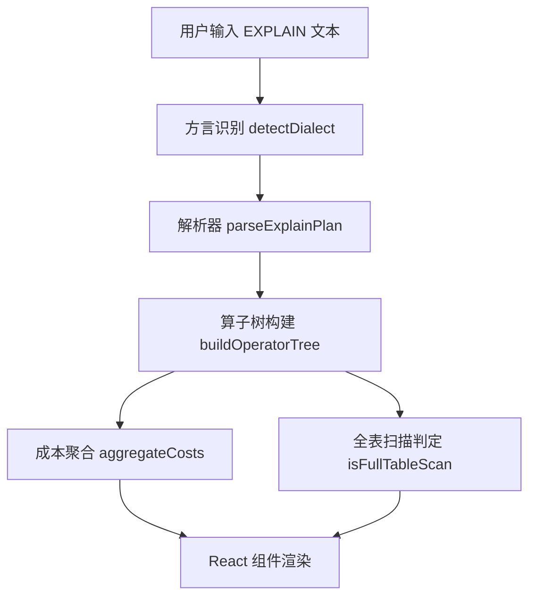

## 1. 架构设计



## 2. 技术描述

- 前端框架：React@19.2.5 + Vite@8.0.10
- 语言：JavaScript (ESM 模块)
- 测试框架：Vitest@4.1.5
- 样式：CSS Modules（独立 .css 文件）
- 状态管理：React useState/useMemo/useCallback
- 图标：使用 SVG 或 Unicode 字符

## 3. 目录结构

```
src/tools/sql-explain-plan-visualizer/
├── __tests__/
│   ├── dialect.test.js          # 方言识别测试
│   ├── parser.test.js           # 解析器测试
│   ├── operatorTree.test.js     # 算子树构建测试
│   └── costAggregate.test.js    # 成本聚合测试
├── logic/
│   ├── dialect.js               # 方言识别
│   ├── parser.js                # 三方言解析器
│   ├── operatorTree.js          # 算子树构建与操作
│   ├── costAggregate.js         # 成本聚合
│   ├── examples.js              # 内置示例
│   └── index.js                 # 统一导出
├── SqlExplainPlanVisualizerTool.jsx    # 主组件
└── SqlExplainPlanVisualizerTool.css    # 样式
```

## 4. 核心数据结构

### OperatorNode（算子节点）
```javascript
{
  id: string,              // 唯一标识
  type: string,            // 算子类型（如 Seq Scan, Index Scan, ALL 等）
  table: string | null,    // 涉及的表名
  rows: number | null,     // 预估行数
  cost: {                  // 成本信息
    start: number,         // 启动成本
    total: number          // 总成本
  },
  filter: string | null,   // 过滤条件
  extra: string | null,    // 额外信息
  raw: string,             // 原始文本行
  children: OperatorNode[],// 子节点
  dialect: 'mysql' | 'postgresql' | 'sqlite'  // 方言
}
```

### ParseResult（解析结果）
```javascript
{
  success: boolean,
  dialect: 'mysql' | 'postgresql' | 'sqlite' | null,
  statements: Array<{
    id: string,
    label: string,
    tree: OperatorNode | null
  }>,
  error: string | null,
  suggestion: string | null
}
```

### CostSummary（成本摘要）
```javascript
{
  totalCost: number,
  maxCostNode: OperatorNode | null,
  totalRows: number,
  fullTableScanCount: number
}
```

## 5. 纯函数 API 定义

### dialect.js
- `detectDialect(text: string): 'mysql' | 'postgresql' | 'sqlite' | null` - 识别方言类型

### parser.js
- `parseMysqlExplain(text: string): Array<OperatorNode>` - 解析 MySQL EXPLAIN
- `parsePostgresqlExplain(text: string): Array<OperatorNode>` - 解析 PostgreSQL EXPLAIN
- `parseSqliteExplain(text: string): Array<OperatorNode>` - 解析 SQLite EXPLAIN
- `parseExplainPlan(text: string): ParseResult` - 统一解析入口

### operatorTree.js
- `buildOperatorTree(rows: Array, dialect: string): OperatorNode` - 构建算子树
- `isFullTableScan(node: OperatorNode): boolean` - 判断是否为全表扫描
- `filterNodes(tree: OperatorNode, keyword: string): OperatorNode[]` - 搜索过滤节点
- `findMaxCostNode(tree: OperatorNode): OperatorNode | null` - 查找最大成本节点
- `collectAllNodes(tree: OperatorNode): OperatorNode[]` - 收集所有节点

### costAggregate.js
- `aggregateCosts(tree: OperatorNode): CostSummary` - 聚合成本信息

## 6. 方言映射规则

| 字段 | MySQL | PostgreSQL | SQLite |
|------|-------|------------|--------|
| 全表扫描 | `type = 'ALL'` | `type = 'Seq Scan'` | `detail 包含 'SCAN TABLE'` |
| 算子类型 | type 列 | 行首关键词 | opcode 列 |
| 表名 | table 列 | 表名部分 | arg1/arg2 列 |
| 行数 | rows 列 | rows=xxx | 预估行数 |
| 成本 | - | cost=start..total | 无 |
| 过滤条件 | Extra 列 | Filter: xxx | 无 |

## 7. 组件结构

1. **主组件 SqlExplainPlanVisualizerTool**
   - 状态管理：输入文本、解析结果、选中节点、展开路径、搜索关键词、当前 Tab
   - 事件处理：解析、示例加载、节点点击、搜索、Tab 切换

2. **子组件 PlanInput**
   - 文本输入区、方言识别标签、示例按钮组

3. **子组件 CostSummaryCards**
   - 三个成本摘要卡片展示

4. **子组件 OperatorTreeNode**
   - 递归渲染算子树节点，支持展开/折叠、高亮

5. **子组件 NodeDetailPanel**
   - 显示选中节点的 JSON 详情
